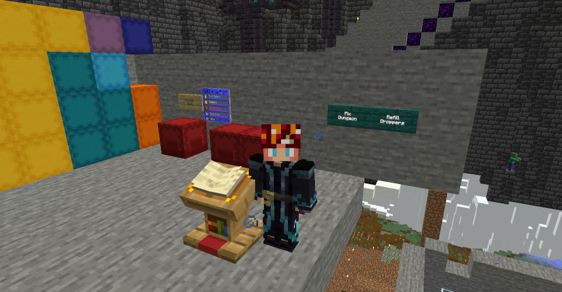

# Decked Out 2 Datapacks

## Refill Datapack

Adds an area with two right-clickable signs, that can be used for dungeon maintenance. Area is located behind egg room in the lobby, in the area Tango used as exit into the Citatel interior.

 * `[Fix Dungeon]` applies one-time fixes to dungeon, like filling some holes, fixing redstone or refilling completly empty droppers.

 * `[Refill Droppers]` sets all item counts in known droppers to 64. It requires item to be already in that dropper - but if you change some items (e.g. coins to crowns) that change will be preserved.

For more automation you can put `function do2_refill:refill_droppers` in a command block and connect it to some existing redstone (e.g. to the button at `-561 115 1974`).

Download `.zip` here: [do2_refill.zip](https://github.com/Noxitu/Decked-Out-2-Datapacks/releases/download/do2_refill_v1.2/do2_refill.zip)
